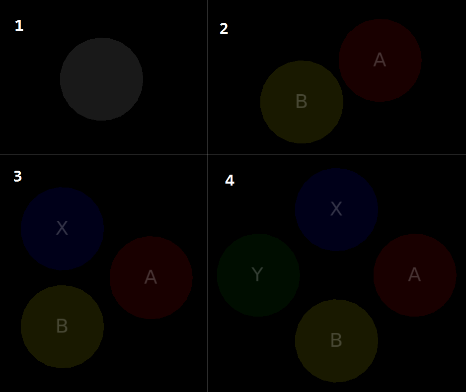

# MonkeyLove
GUI and gamepad library for [LÖVE](http://love2d.org) for Android Devices.
Have been only tested in [LÖVE 11.3]. No guarantee it will work on other versions.


**This Library use some globals for convenience.** More info below.

## Modules
### Analog
A customizable analog stick. 
Can be not static or static.


Create a analog instance:
``` [Lua]
newAnalog = Analog:new(Ar, Right, Ax, Ay, Br, Bd, BBy, Spring, Reclick, Limited, Range, Release, Hitbox)
```
Arg | Explanation
--- | ---
Ar | Analog radius.
Right | If true and is not static, the stick will be in the right-side of the screen.
Ax, Ay | Position X and Y of the Analog in the screen if is static. If Ax and Ay are nil, the analog will be a static one.
Br | Button of the stick radius. Default to Ar/2.
Bd | Stick deadzone. Range between 0 and 1. Default to 0.
BBy | OffSet of Bounding Box Y. Used only if the stick is not static. Range 0 to ScreenHeight/2.
Spring | If true, the analog stick returns to the center after being released. If false, stays in place and retains movement output. Default to true.
Reclick | If true, you can catch the stick after being released before it reaches the center (with spring on). If false, the stick can only be grabbed again once it reaches the center. Default to true.
Limited | If true, does not change the stick's angle if you move it further than its effect radius. If false, moves it around as if it was being moved within its effect radius. Default to false.
Range | If true, releases the stick once you move it further than its effect radius (with spring on). If false, continues taking actions based on the previous setting. Default to false.
Release | Defines the time (in seconds) it takes for the stick to reach the center once released (with spring on). Default to 0.2.
Hitbox | Radius of the stick's hitbox. Default to Ar.

Return X position of the stick. Range from -1 to 1.
``` [Lua]
newAnalog:getX()
```
Return Y position of the stick. Range from -1 to 1.
```
newAnalog:getY()
```
Return true or false about whether or not the stick is being held.
```
newAnalog:isHeld()
```
Enable/Disable a button instance.
```
newAnalog:toggleEnabled()
```
### Gamepad 
A customizable gamepad.


Create a gamepad button instance.

```
GPButton = Gamepad:new(Radius,X,Y,Label,Normal,Pressed,Font,Mode)
```
Arg | Explanation
--- | ---
Radius | Radius of the button.
X,Y | Position X and Y of the button.
Label | Label of the gamepad button.
Normal,Pressed | Button color if not pressed and if pressed respectively.
Font | Previously loaded font.
Mode | Mode of circle draw. Default to "fill".

Create a preset gamepad instance. The Default buttons names are: Gamepad.B, Gamepad.A, Gamepad.X, Gamepad.Y, Gamepad.DOWN, Gamepad.RIGHT, Gamepad.UP, Gamepad.LEFT.
```
Gamepad:setGamepad(Radius, Number, D_pad, Px, Py, Font, Mode)
```
Arg | Explanation
--- | ---
Radius | Radius of all buttons.
Number | Number of frontal buttons. Range between 1 and 4. For the Default buttons names, see below.
D_pad | If true will be draw a D-pad. For the Default buttons names, see below. Gamepad.DOWN, Gamepad.RIGHT, Gamepad.UP, Gamepad.LEFT.
Px, Py | Position X and Y of the formation center of frontal buttons. Not change the D-pad position.
Font | Previously loaded font.
Mode | Mode of circle draw. Default to "fill".

Value | Buttons names
--- | ---
Number = 1 | Gamepad.B
Number = 2 | Gamepad.B, Gamepad.A
Number = 3 | Gamepad.B, Gamepad.A, Gamepad.X
Number = 4 | Gamepad.B, Gamepad.A, Gamepad.X, Gamepad.Y
D_pad = true | Gamepad.DOWN, Gamepad.RIGHT, Gamepad.UP, Gamepad.LEFT

Buttons formation.


D-pad.


Return true or false about whether or not the gamepad button is being held.
```
newGPButton:isHeld()
```
Return true or false if the gamepad button is pressed.
```
newGPButton:isPressed()
```
Return true or false if the gamepad button is released.
```
newGPButton:isReleased()
```
Enable/Disable all gamepad buttons.
```
Gamepad:toggleEnabled() 
```
### Button
A customizable rectangular button.


Create a button instance.
```
Button = Button:new(image, w, h, x, y, label, onClick, normal, pressed, toggled, onToggle, labelToggled, font, onRelease, update)
```
* image: Previously loaded image or Path to load a new one. If this argument is nil, then will be create a rectangle instead
* w, h: Width and height of the rectangle if is not used a image. Else make them nil. 
* x, y: Position X and Y of the Button in the screen.
* label: Label of the button.
* onClick: Callback of the button(function).
* normal, pressed, toggled: Button color if not pressed, if pressed and in toggled state respectively.
* onToggle: Callback of the button in toggled state(function). If nil toggled will be disabled.

* labelToggled: Label when its in toggled state.
* font: Previously loaded font. 
* onRelease: Callback when the button is released(function). Not fully tested.
* update: Callback of the button every update(function). Not fully tested.

Enable/Disable a button instance.


```
newButton:toggleEnabled() 
```
### EditText
A text input.


Create a EditText instance.
```
newEditText = EditText:new(x, y, w, align, font, lineColor, focusColor, fontColor, callback, customtext, filter)
```
* x,y: Position X and Y of the EditText in the screen.
* w: Width of the line(max width of the input text).
* align: Align of the text("left", "center", or "right").
* font: Previously loaded font. 
* lineColor,focusColor,fontColor: Line color in normal state, line color in focus state and font color respectively.
* callback: Callback when "*return*" key is pressed(function).
* customtext: Text already entered.
* filter: String with all allowed characters.

Enable/Disable a EditText instance.
```
newEditText:toggleEnabled()
```
### ProgressBar
A multi-uses progress bar.


Create a ProgressBar instance.
```
newProgressBar = ProgressBar:new(x, y, maxw, h, maxv, minv, text1, text2, font, barColor, fontColor, notFilled, minw)
```
* x,y: Position X and Y of the ProgressBar in the screen.
* maxw: Width of the progress bar.
* h: Height of the progress bar.
* maxv: Max printed value. Set to 100.
* minv: Min printed value. Set to 0.
* text1: Text before printed value.
* text2: Text after printed value.
* font: Previously loaded font. 
* barColor,fontColor,notFilled: Bar color, font color and bar not filled color respectively. 
* minw: Start position of the increment Bar. Set to 0. Not used.

Icrease the value in ProgressBar instance.
```
newProgressBar:IncreaseProgress(inc)
```
Pauses/Resume a ProgressBar instance.
```
newProgressBar:togglePaused()
```
### Slider
A slider.


Create a Slider instance.
```
newSlider = Slider:new(x, y, w, max, cursor, radius, normal, alpha)
```
* x,y: Position X and Y of the Slider in the screen.
* w: Width of the Slider.
* max: Max representable value of the slider.
* cursor: Cursor custom position.
* radius: Radius of the cursor.
* normal,alpha: Slider color and guide rectangle color respectively. 

Return the current value of the Slider instance.
```
newSlider:cursorValue()
```
Enable/Disable a Slider instance.
```
newSlider:toggleEnabled()
```
### Stepper
A stepper for toggle options.


Create a Slider instance.
```
newStepper = Stepper:new(x, y, w, h, lLabel, rLabel, max, selections, step, loop, separation, custom, font, normal, pressed)
```
* x,y: Position X and Y of the Stepper in the screen.
* w,h: Width and height of the Stepper. The width does not include the width of the buttons(width of button = height of stepper).
* lLabel,rLabel: Left button label and right button label respectively.
* max: Max number of selections/value.
* selections: Table with selections/options for toggle. 
* step: Number of steps taken by the Stepper each time a button is pressed.
* loop: (Boolean) If is true then the stepper will move in loop. 
* separation: Separation between Buttons and selection/value label.
* custom: Preselected value.
* font: Previously loaded font. 
* normal: Normal color of the buttons and selection box.
* pressed: Buttons pressed color. 

Enable/Disable a Slider instance.
```
newStepper:toggleEnabled()
```
Return the current selection/value of the Stepper instance.
```
newStepper:currentSelection()
```
### Tools
Useful multipurpose functions.

Return(boolean). Return true if the touch is inside of a given rectangle.
```
isInsideBoundingBox(self, tx, ty)
```
Return(boolean). Return true if the touch is inside of a given circle.
```
isInsideCircle(self, tx, ty)
```
Return(number). Distance between 2 points.
```
getDistance(x2, y2, x1, y1)
```
Return(number). Angle in radians given 2 points.
```
getAngle(x2, y2, x1, y1)
```
Draw a customizable label, vertically centered given a height. For more info see [love.graphics.printf](http://love2d.org/wiki/love.graphics.printf)


```
setLabel(text, font, x, y, limit, height, align, r, sx, sy, ox, oy, kx, ky)
```
Load and set a ".ttf" font located in "assets/font".
[!!!]Don't use this function inside of draw or update, because can cause slow downs.
```
setFont(name, size)
```
Allow to use web notation of colors.(0-255, alpha default to 255).
```
rgb(r, g, b, a)
```
Return(table). Return grayscale color, 0=Black y 1=White. Alpha defaults to 1.
```
grayscale(level, alpha)
```
Return(table), of a already preset color. Alpha defaults to 1. For more info see [Colors.png]
```
colors(color, alpha)
```
## Installation
First Copy the "monkeylove" lua file and the folder with the same name into the directory of your project. 
Next require it in your main(or leading file in your project):
``` [Lua]
local MonkeyLove = require 'path_to_file.monkeylove'
```
Where "path_to_file" is the directory where you put "monkeylove" folder and lua file.
Finally, in love's callbacks add:
``` [Lua]
function love.update(dt)
	MonkeyLove:update(dt)
end

function love.draw()
	MonkeyLove:draw()
end

function love.textinput(text)
	MonkeyLove:textinput(text)
end

function love.keypressed(key, scancode, isrepeat)
	MonkeyLove:keypressed(key, scancode, isrepeat)
end

function love.touchpressed(id, x, y)
	MonkeyLove:touchpressed(id, x, y)
end

function love.touchmoved(id, x, y)
	MonkeyLove:touchmoved(id, x, y)
end

function love.touchreleased(id, x, y)
	MonkeyLove:touchreleased(id, x, y)
end
```
## Globals
### Global Variables:
Variable | Module
--- | ---
class | "init.lua" (Module)
Tools | "init.lua" (Module)
Analog | "init.lua" (Class Module)
Gamepad | "init.lua" (Class Module)
Button | "init.lua" (Class Module)
EditText | "init.lua" (Class Module)
ProgressBar | "init.lua" (Class Module)
Slider | "init.lua" (Class Module)
Stepper | "init.lua" (Class Module)
### Global Variables:
Variable | Module
--- | ---
cdefaultLineWidth() | "tools.lua"
isInsideBoundingBox() | "tools.lua"
isInsideCircle() | "tools.lua"
getAngle() | "tools.lua"
getDistance() | "tools.lua"
getFontYOffset() | "tools.lua"
setLabel() | "tools.lua"
setFont() | "tools.lua"
rgb() | "tools.lua"
grayscale() | "tools.lua"
colors() | "tools.lua"
